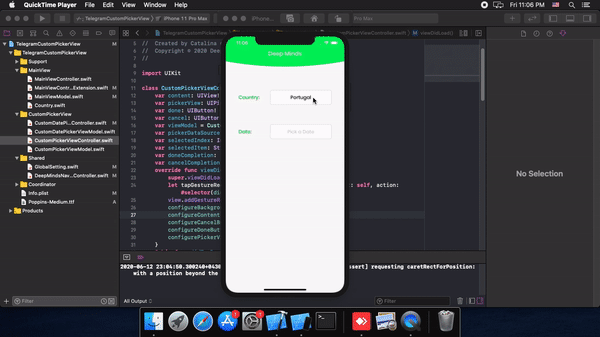

# TelegramPickerView
A picker view like what exists in telegram
## Picker View

In the CustomPikcerView folder, you can find CustomPickerViewController and CustomPickerViewModel. The view model as its name represents is for view presentations and constraints, change this file should you want to change the way that picker view appears. In the view controller file, you can find the data source for the picker view, and also there is a selected index variable to set the picker view to the item that is previously picked and the user wants it to change. After you instantiate the CustomPickerViewController, set its data source, and selected index from the data that you presented in the main view controller. Do not forget to update the selected index after you set a new item in the picker. You can find the sample code under showTextFeildPicker function in the MainViewController+Extension file. 

## Date Picker View

In the CustomPikcerView folder, you can find CustomDatePickerViewController and CustomDatePickerViewModel. The view model as its name represents is for view presentations and constraints, change this file should you want to change the way that picker view appears. In the view controller file, you can find the optional variable date to set the date of date picker view in the case that the user has previously picked a date. After you instantiate the CustomDatePickerViewController, set its date variable to the date that you presented in the main view controller. Do not forget to update the date after you set a new date in the picker. You can find the sample code under showTextFeildDatePicker function in the MainViewController+Extension file.

